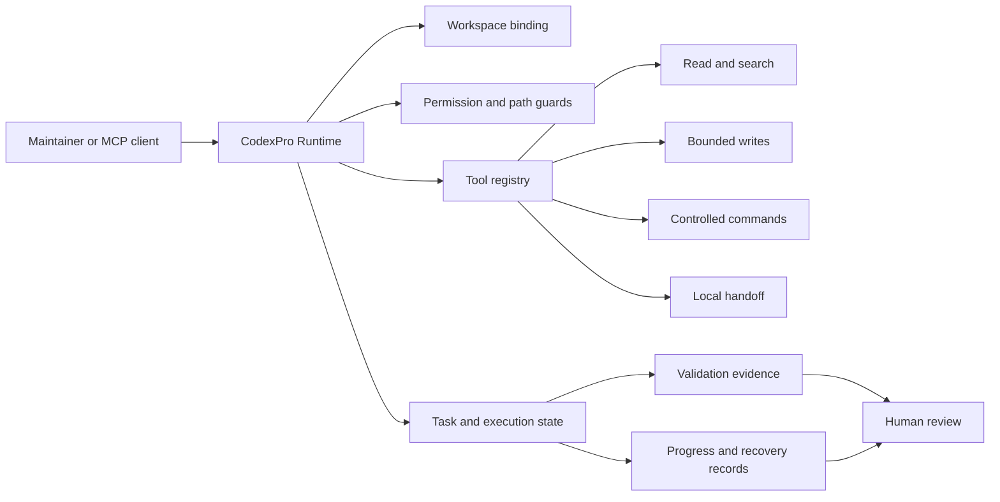

# CodexPro Runtime

[](https://github.com/Menglook/codexpro-runtime/actions/workflows/ci.yml)
[](LICENSE)
[](package.json)
[](https://github.com/Menglook/codexpro-runtime)
[](https://github.com/Menglook/codexpro-runtime/releases)
[](https://github.com/Menglook/codexpro-runtime/stargazers)
[](https://github.com/Menglook/codexpro-runtime/forks)

**A local, evidence-driven agent runtime and MCP control plane for open-source maintainers.**

CodexPro Runtime turns an explicitly allowed source workspace into a bounded tool surface for AI-assisted engineering. It combines workspace isolation, MCP transports, controlled file and command tools, durable execution records, validation primitives, and human review boundaries in one local runtime.

[中文说明](README.zh-CN.md) · [Quickstart](docs/quickstart.md) · [Architecture](docs/architecture.md) · [Security model](docs/security-model.md) · [Codex Security case](docs/codex-security-case.md) · [Governance](GOVERNANCE.md) · [Roadmap](ROADMAP.md) · [Contributing](CONTRIBUTING.md) · [Adoption evidence](docs/adoption.md)

> **Source preview.** The GitHub repository is public. The npm package `@menglook/codexpro` is intentionally not published and `package.json` remains `private: true`. No GitHub Release, Pages deployment, hosted relay, or managed service is provided.

## Why CodexPro exists

AI coding systems can generate useful plans and patches, but maintainers still need answers to four operational questions:

1. Which workspace and files may the assistant access?
2. Which side effects are enabled for this session?
3. What evidence proves that a task actually completed?
4. Where does human review remain authoritative?

CodexPro makes those questions part of the runtime instead of leaving them as prompt-only conventions.

## Core value

| Capability | What it provides | Maintainer benefit |
|---|---|---|
| **Workspace-bounded control plane** | Explicit workspace roots, path guards, blocked paths, symlink checks, and conversation-scoped workspace binding | Reduces accidental cross-repository access and ambiguous execution context |
| **Evidence-driven execution** | Structured task state, validation results, durable job records, progress receipts, and machine-readable schemas | Separates “the model said it finished” from verifiable completion evidence |
| **Human-controlled autonomy** | Configurable read/write/bash modes, local handoff workflows, review steps, and fail-closed controls | Lets maintainers choose planning-only, bounded editing, or trusted local execution |
| **Composable local integration** | MCP over stdio and Streamable HTTP, CLI entry points, reusable schemas, templates, and browser skill primitives | Supports local tools without requiring a hosted source-code service |

## 90-second source verification

Requirements: Node.js 20 or newer and npm.

```bash
git clone https://github.com/Menglook/codexpro-runtime.git
cd codexpro-runtime
npm ci --ignore-scripts --no-audit --no-fund
npm run typecheck
npm run build
npm run cli:help
```

Optional package-surface check:

```bash
npm run pack:dry-run
```

These commands verify the public source tree. They do **not** publish a package, create a release, start a public tunnel, or connect an external account.

## What you can inspect today

After building from source:

```bash
node dist/stdio.js --help
node dist/http.js --help
node scripts/codexpro-cli.mjs --help
node scripts/codexpro.mjs --help
```

Public entry points reserved in `package.json`:

| Entry point | Purpose | Current availability |
|---|---|---|
| `codexpro-mcp` | MCP stdio server | Build from source |
| `codexpro-mcp-http` | MCP Streamable HTTP server | Build from source |
| `menglook-codexpro` | Runtime and task CLI | Build from source; npm package not published |

## How it works



The runtime is local. It exposes only the tools enabled by the current configuration and workspace policy. A model or MCP client does not gain authority merely because it can describe an action.

## Why this matters for OSS maintainers

### Pull requests

CodexPro can support a reviewable workflow in which an assistant:

- reads only the selected repository;
- searches for the affected implementation and tests;
- prepares a bounded patch or handoff plan;
- runs configured validation commands;
- returns changed-file and evidence summaries for human review.

It does not merge a pull request, publish a release, or override repository protection by default.

### Issues and bug reports

A maintainer can preserve the distinction between:

- issue interpretation;
- repository inspection;
- proposed remediation;
- actual file changes;
- validation results;
- final maintainer decision.

This makes failed checks and incomplete evidence visible instead of collapsing everything into a single success message.

### Releases

The runtime can help collect build, typecheck, package-content, and security-gate evidence. Release creation and package publication remain separate, explicit operations outside the default public workflow.

### Security work

CodexPro provides path guards, secret-aware writes, redaction, configurable command modes, explicit allowed roots, and a documented threat boundary. These are risk-reduction controls, not an operating-system sandbox.

See [Maintainer workflows](docs/maintainer-workflows.md) for concrete patterns.

## Product boundary

CodexPro Runtime is:

- a local developer runtime;
- an MCP server implementation;
- a controlled workspace tool surface;
- an execution and validation substrate;
- a set of reusable schemas, templates, and CLI components.

CodexPro Runtime is not:

- a hosted SaaS source-code platform;
- an OpenAI product or an OpenAI-endorsed project;
- a replacement for repository permissions, branch protection, code review, or operating-system isolation;
- a mechanism for bypassing model, account, product, safety, or quota limits;
- an autonomous publisher of packages, releases, deployments, or pull requests;
- a guarantee that any particular MCP client or model will invoke every exposed tool.

## Threat boundary

The main security assumptions are explicit:

- the maintainer controls the local machine and selected workspace root;
- the connected MCP client may be fallible or untrusted;
- file writes and command execution are side effects and must be policy-controlled;
- public or non-loopback HTTP access requires authentication;
- tokens, private paths, customer data, and runtime evidence must not enter the public repository;
- full shell mode is a trusted-local choice, not a safe default;
- symlink and path traversal checks reduce risk but do not replace OS sandboxing.

Read [SECURITY.md](SECURITY.md) and [Security model](docs/security-model.md) before exposing an HTTP endpoint or enabling workspace writes.

## Execution modes

The underlying runtime supports different capability profiles. Exact flags and availability may evolve while the npm package is unpublished.

| Mode | Intended use | Generic source writes | Shell posture |
|---|---|---:|---|
| Read-only / minimal | Inspection and analysis | No | Off or tightly limited |
| Handoff | ChatGPT or another planner writes bounded `.ai-bridge` plans | No generic writes | Safe or off |
| Workspace agent | Trusted local engineering session | Configurable | Safe by default; full only when explicitly selected |
| Local task runner | Durable local execution and review | Controlled by task configuration | Local process boundary |

The public repository documents these concepts without claiming that a hosted service or reviewed ChatGPT app is currently available.

## Public component map

| Area | Included public surface |
|---|---|
| MCP | stdio and Streamable HTTP entry points, modern request handling, tool result envelopes |
| Workspace | root resolution, workspace identity, conversation binding, path guards |
| Execution | task state, durable jobs, process records, progress, recovery, review primitives |
| Tools | read, search, bounded editing, validation, project inspection, handoff coordination |
| Security | authorization decisions, redaction, secret-aware writes, blocked-path policy |
| Browser | reusable browser runtime primitives and a generic skill example |
| Schemas | execution, authorization, messaging, browser, task, capability, and evidence contracts |
| Templates | starter project, acceptance, and memory templates |
| CLI | source-level runtime and task command surfaces |

See [Architecture](docs/architecture.md) for the component relationships and trust boundaries.

## Source quickstart

### Install dependencies

```bash
npm ci --ignore-scripts --no-audit --no-fund
```

`--ignore-scripts` is used for the initial source verification so dependency installation does not execute package lifecycle scripts.

### Validate

```bash
npm run typecheck
npm run build
npm run cli:help
npm run pack:dry-run
```

### Inspect MCP server help

```bash
node dist/stdio.js --help
node dist/http.js --help
```

### Inspect the local CLI

```bash
node scripts/codexpro-cli.mjs --help
node scripts/codexpro.mjs --help
```

For a fuller walkthrough, read [Quickstart](docs/quickstart.md). Do not expose the HTTP server publicly until you understand the authentication and workspace-root controls.

## Validation and evidence

The public CI workflow runs:

1. dependency installation with lifecycle scripts disabled;
2. TypeScript type checking;
3. TypeScript build;
4. CLI help verification;
5. npm package-content dry run.

Local publication additionally requires a sanitized export boundary and secret scan. The private implementation remains the authority for production-only integrations and internal evidence.

A green CI result means the checked public source revision passed these repository checks. It does not certify a deployment, external account, hosted app, or all possible runtime configurations.

## Adoption snapshot

The attributable baseline captured at **2026-08-03 16:46:44 UTC** records 0 stars, 0 forks, 0 watchers, 1 contributor, 3 commits in both the preceding 30-day and 90-day windows, 0 issues, 0 pull requests, and 0 GitHub Releases. GitHub's trailing 14-day owner traffic aggregate recorded 0 views and 0 clones.

The npm package is not published, so weekly and monthly downloads are **not applicable**, not zero. No public user count, independent case study, or third-party testimonial is claimed.

See [Adoption evidence](docs/adoption.md) for sources, methods, live badges, maintainer-operated validation scenarios, the voluntary feedback route, and the explicit separation between this repository and upstream ecosystem metrics.

## Public and private boundary

This repository excludes:

- private runtime state and `.codexpro` execution evidence;
- `.ai-bridge` task snapshots and local handoff records;
- customer or business integrations;
- production hostnames, tunnel identity, credentials, and machine-specific paths;
- internal office reports and benchmark evidence;
- the complete private Git history;
- private deployment orchestration.

Public changes are exported through an explicit allowlist and must pass source, package-content, and secret-scanning checks before publication.

See [Public boundary](docs/public-boundary.md).

## Documentation

| Document | Purpose |
|---|---|
| [Quickstart](docs/quickstart.md) | Build and inspect the public source safely |
| [Architecture](docs/architecture.md) | Runtime layers, data flow, and component boundaries |
| [Security model](docs/security-model.md) | Product boundary, threat assumptions, and safer defaults |
| [Maintainer workflows](docs/maintainer-workflows.md) | PR, issue, release, and security workflow patterns |
| [Adoption evidence](docs/adoption.md) | Attributable metrics, measurement method, use-case classification, and feedback route |
| [Public boundary](docs/public-boundary.md) | What is intentionally included and excluded |
| [Troubleshooting](docs/troubleshooting.md) | Common source-preview setup and validation failures |
| [Security policy](SECURITY.md) | Vulnerability reporting and hard security rules |
| [Governance](GOVERNANCE.md) | Current maintainer authority, decisions, releases, and succession |
| [Roadmap](ROADMAP.md) | Now/Next/Later direction and real contribution Issues |
| [Code of Conduct](CODE_OF_CONDUCT.md) | Participation standards and private reporting |
| [Contributing](CONTRIBUTING.md) | Issue routes, setup, validation, licensing, and review expectations |
| [Public launch checklist](PUBLIC_LAUNCH_CHECKLIST.md) | Gates before npm, release, app, or hosted announcements |
| [Notices](NOTICE.md) | Upstream attribution and independent-maintainer status |

## Repository status

The repository is currently a source preview rather than a stable packaged release.

Public governance, structured Issue and pull-request entry points, the required label set, and four bounded newcomer tasks are now available. Current work is tracked in [ROADMAP.md](ROADMAP.md), including Issues [#1](https://github.com/Menglook/codexpro-runtime/issues/1), [#2](https://github.com/Menglook/codexpro-runtime/issues/2), [#3](https://github.com/Menglook/codexpro-runtime/issues/3), and [#4](https://github.com/Menglook/codexpro-runtime/issues/4).

GitHub Discussions remains disabled until recurring Q&A or announcements justify a separately moderated channel. No roadmap item should be interpreted as a promise of a release date or external product support.

## Contributing

Contributions should remain generic, reviewable, and independent of private operational configuration.

Before opening a pull request:

```bash
npm ci --ignore-scripts --no-audit --no-fund
npm run typecheck
npm run build
npm run cli:help
npm run pack:dry-run
```

Do not include credentials, private repository contents, production URLs, customer data, local reports, or private machine paths.

Read [CONTRIBUTING.md](CONTRIBUTING.md) for Issue routes, focused validation, licensing, AI-assistance disclosure, and review expectations. Project authority is documented in [GOVERNANCE.md](GOVERNANCE.md), and all participation follows [CODE_OF_CONDUCT.md](CODE_OF_CONDUCT.md).

## Security reporting

Please do not place vulnerability details or secrets in a public issue. Follow [SECURITY.md](SECURITY.md) for private reporting options and disclosure expectations.

## Independent project and attribution

This repository is maintained independently by Menglook. It is not the upstream project and is not endorsed by OpenAI.

The work is derived from [rebel0789/codexpro](https://github.com/rebel0789/codexpro) under the MIT License and contains independent modifications. Upstream stars, forks, downloads, maintainers, issues, pull requests, website traffic, and other adoption metrics are not metrics of this repository.

See [NOTICE.md](NOTICE.md) and [LICENSE](LICENSE).

## License

MIT License. See [LICENSE](LICENSE).
