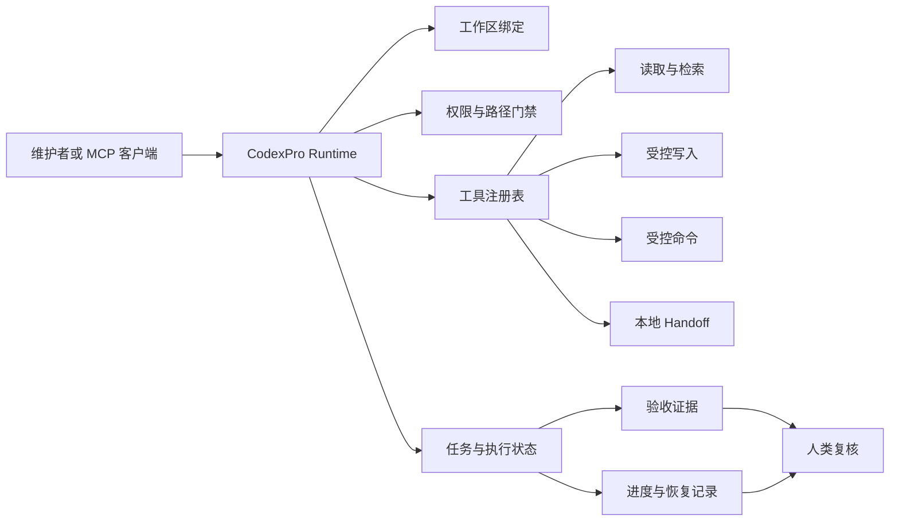

# CodexPro Runtime

[](https://github.com/Menglook/codexpro-runtime/actions/workflows/ci.yml)
[](LICENSE)
[](package.json)
[](https://github.com/Menglook/codexpro-runtime)
[](https://github.com/Menglook/codexpro-runtime/releases)
[](https://github.com/Menglook/codexpro-runtime/stargazers)
[](https://github.com/Menglook/codexpro-runtime/forks)

**面向开源维护者的本地、证据驱动 Agent Runtime 与 MCP 控制平面。**

CodexPro Runtime 把一个明确授权的源码工作区转换为受边界约束的 AI 工程工具面：统一提供工作区隔离、MCP 传输、受控文件与命令工具、Durable 执行记录、验收原语和人类复核边界。

[English](README.md) · [快速开始](docs/quickstart.md) · [架构](docs/architecture.md) · [安全模型](docs/security-model.md) · [治理](GOVERNANCE.md) · [路线图](ROADMAP.md) · [贡献指南](CONTRIBUTING.md) · [采用证据](docs/adoption.md)

> **源码预览阶段。** GitHub 仓库已经公开，但 npm 包 `@menglook/codexpro` 尚未发布，`package.json` 继续保持 `private: true`。当前没有 GitHub Release、Pages、托管中继或公共 SaaS 服务。

## 为什么需要 CodexPro

AI 编程系统可以生成计划和补丁，但维护者仍然需要明确回答：

1. 助手允许访问哪个工作区和哪些文件？
2. 当前会话开放了哪些副作用能力？
3. 什么证据能够证明任务真实完成？
4. 哪些决策仍然必须由人类维护者做出？

CodexPro 把这些问题放进运行时契约，而不是只依赖提示词约定。

## 四项核心价值

| 能力 | 提供什么 | 对维护者的价值 |
|---|---|---|
| **工作区边界控制平面** | 明确根目录、路径门禁、阻断目录、符号链接检查、会话级工作区绑定 | 减少跨项目误读、误写和执行上下文混乱 |
| **证据驱动执行** | 结构化任务状态、验收结果、Durable Job、进度回执和机器可读 Schema | 区分“模型声称完成”和“有证据证明完成” |
| **人类控制的自主性** | 可配置读写与 Bash 模式、本地 Handoff、Review 和失败关闭策略 | 可按任务选择只读、规划交接、受控编辑或可信本地执行 |
| **可组合的本地集成** | stdio/Streamable HTTP MCP、CLI、Schema、模板和浏览器技能原语 | 不依赖托管源码服务也能构建本地 AI 工程流程 |

## 90 秒源码验证

要求：Node.js 20 或更高版本、npm。

```bash
git clone https://github.com/Menglook/codexpro-runtime.git
cd codexpro-runtime
npm ci --ignore-scripts --no-audit --no-fund
npm run typecheck
npm run build
npm run cli:help
```

可选的 npm 打包内容检查：

```bash
npm run pack:dry-run
```

这些命令只验证公开源码，不会发布 npm、创建 Release、启动公网 Tunnel 或连接外部账号。

## 当前可检查的入口

完成构建后：

```bash
node dist/stdio.js --help
node dist/http.js --help
node scripts/codexpro-cli.mjs --help
node scripts/codexpro.mjs --help
```

`package.json` 中预留的公开入口：

| 入口 | 用途 | 当前状态 |
|---|---|---|
| `codexpro-mcp` | MCP stdio 服务 | 从源码构建后使用 |
| `codexpro-mcp-http` | MCP Streamable HTTP 服务 | 从源码构建后使用 |
| `menglook-codexpro` | Runtime 与 Task CLI | 从源码使用；npm 尚未发布 |

## 工作方式



运行时位于用户本机。只有当前配置和工作区策略允许的工具会被暴露。模型或 MCP 客户端能够描述一个操作，并不代表它自动获得执行权限。

## 为什么适合 OSS 维护者

### Pull Request

助手可以在受控流程中：

- 读取选定仓库；
- 定位实现和测试；
- 准备受限补丁或 Handoff 计划；
- 运行已配置的验收命令；
- 返回改动文件和证据摘要。

默认流程不会自动合并 PR、创建 Release 或绕过仓库保护规则。

### Issue 与缺陷修复

CodexPro 将以下阶段明确分开：

- 理解问题；
- 检查仓库；
- 提出修复；
- 实际修改；
- 执行验收；
- 维护者作出最终决定。

失败的检查和缺失的证据不会被压缩成一个笼统的“完成”。

### Release

运行时可以协助收集 Build、Typecheck、打包清单和安全门禁证据，但发布包、创建 Release 和部署仍是独立的显式操作。

### 安全工作

公开实现包含路径门禁、敏感写入扫描、脱敏、可配置命令模式和明确工作区根目录。这些是风险降低措施，不是操作系统级沙箱。

更多模式见 [维护者工作流](docs/maintainer-workflows.md)。

## 产品边界

CodexPro Runtime 是：

- 本地开发者运行时；
- MCP 服务实现；
- 受控工作区工具面；
- 执行与验收基础设施；
- 可复用 Schema、模板和 CLI 组件集合。

CodexPro Runtime 不是：

- 托管式源码 SaaS；
- OpenAI 产品或获得 OpenAI 背书的项目；
- 仓库权限、分支保护、代码审查或 OS 隔离的替代品；
- 绕过模型、账号、产品、安全或额度限制的机制；
- 自动发布 npm、Release、部署或 PR 的服务；
- 对任何 MCP 客户端或模型调用全部工具的保证。

## 威胁边界

核心假设包括：

- 维护者控制本机和选定工作区；
- MCP 客户端可能出错或不可信；
- 写文件和执行命令属于副作用，必须由策略控制；
- 公网或非 Loopback HTTP 必须启用认证；
- Token、私有路径、客户数据和运行证据不得进入公开仓库；
- Full Bash 是可信本地选择，不是安全默认值；
- 路径和符号链接门禁不能替代 OS 沙箱。

公开 HTTP 端点或 Workspace 写入前，请阅读 [SECURITY.md](SECURITY.md) 和 [安全模型](docs/security-model.md)。

## 运行模式

底层运行时支持不同能力组合。npm 尚未发布期间，具体参数仍可能调整。

| 模式 | 用途 | 通用源码写入 | Shell 策略 |
|---|---|---:|---|
| Read-only / Minimal | 检查与分析 | 否 | 关闭或严格限制 |
| Handoff | 规划者只写受限 `.ai-bridge` 交接文件 | 不开放通用写入 | Safe 或 Off |
| Workspace Agent | 可信本地工程会话 | 可配置 | 默认 Safe；显式选择 Full |
| Local Task Runner | Durable 本地执行与复核 | 由任务配置控制 | 本地进程边界 |

公开仓库只描述真实存在的本地能力，不声称已有托管服务或审核通过的公共 ChatGPT App。

## 公开组件

| 领域 | 公开内容 |
|---|---|
| MCP | stdio、Streamable HTTP、现代协议处理、工具结果 Envelope |
| Workspace | 根目录解析、工作区身份、会话绑定、路径门禁 |
| Execution | Task、Durable Job、进程记录、进度、恢复和 Review 原语 |
| Tools | Read、Search、受控编辑、验收、项目检查和 Handoff 协调 |
| Security | 授权决策、脱敏、敏感写入门禁、阻断路径策略 |
| Browser | 可复用浏览器运行时原语和通用技能示例 |
| Schemas | 执行、授权、消息、浏览器、任务、能力和证据契约 |
| Templates | Project、Acceptance 和 Memory 起始模板 |
| CLI | 源码级 Runtime 与 Task 命令面 |

详见 [架构](docs/architecture.md)。

## 验收与证据

公开 CI 执行：

1. 禁用生命周期脚本安装依赖；
2. TypeScript Typecheck；
3. TypeScript Build；
4. CLI Help 验证；
5. npm 打包内容 Dry Run。

公开导出还需要净化边界和敏感信息扫描。私有实现仍是生产专用集成和内部证据的权威来源。

CI 通过只表示该公开提交通过了仓库级检查，不代表任何部署、外部账号、托管 App 或全部运行配置已获认证。

## Adoption Snapshot

可归属基线采集于 **2026-08-03 16:46:44 UTC**：Stars 0、Forks 0、Watchers 0、贡献者 1、近 30 天和近 90 天提交均为 3、Issues 0、Pull Requests 0、GitHub Releases 0；GitHub 维护者可见的近 14 天聚合流量为 Views 0、Clones 0。

npm 包尚未发布，因此周下载量和月下载量应标记为**不适用**，不能写成 0。当前不声明公共用户数、独立案例或第三方证言。

详见 [采用证据](docs/adoption.md)：其中记录数据来源、采集方法、动态徽章、维护者真实验证场景、自愿反馈入口，以及本仓库与上游生态指标之间的严格边界。

## 公开与私有边界

本仓库明确排除：

- 私有运行状态和 `.codexpro` 执行证据；
- `.ai-bridge` Task Snapshot 与本地 Handoff 记录；
- 客户或业务集成；
- 生产域名、Tunnel 身份、凭证和机器路径；
- 内部办公室报告和 Benchmark 证据；
- 私有完整 Git 历史；
- 私有部署编排。

公开变更必须经过显式白名单导出，并通过源码、打包内容和敏感信息门禁。

详见 [公开边界](docs/public-boundary.md)。

## 文档导航

| 文档 | 用途 |
|---|---|
| [快速开始](docs/quickstart.md) | 安全构建和检查公开源码 |
| [架构](docs/architecture.md) | Runtime 层次、数据流和组件边界 |
| [安全模型](docs/security-model.md) | 产品边界、威胁假设和安全默认值 |
| [维护者工作流](docs/maintainer-workflows.md) | PR、Issue、Release 和安全流程模式 |
| [采用证据](docs/adoption.md) | 可归属指标、测量方法、用例分类和反馈入口 |
| [公开边界](docs/public-boundary.md) | 明确公开与排除内容 |
| [故障排查](docs/troubleshooting.md) | 源码预览常见安装和验收问题 |
| [安全政策](SECURITY.md) | 漏洞报告与硬性安全规则 |
| [治理](GOVERNANCE.md) | 当前维护权限、决策、发布与继任机制 |
| [路线图](ROADMAP.md) | Now/Next/Later 方向和真实贡献 Issues |
| [行为准则](CODE_OF_CONDUCT.md) | 参与规范与私密报告方式 |
| [贡献指南](CONTRIBUTING.md) | Issue 入口、环境、验收、许可和 Review 要求 |
| [公开发布清单](PUBLIC_LAUNCH_CHECKLIST.md) | npm、Release、App 或托管公告前的门禁 |
| [归属说明](NOTICE.md) | 上游归属和独立维护身份 |

## 当前状态

当前仓库是源码预览，而不是稳定 npm Release。

公开治理、结构化 Issue/PR 入口、计划要求的标签体系以及四个边界清晰的首次贡献任务已经建立。当前工作见 [ROADMAP.md](ROADMAP.md)，包括 Issues [#1](https://github.com/Menglook/codexpro-runtime/issues/1)、[#2](https://github.com/Menglook/codexpro-runtime/issues/2)、[#3](https://github.com/Menglook/codexpro-runtime/issues/3) 和 [#4](https://github.com/Menglook/codexpro-runtime/issues/4)。

GitHub Discussions 暂不启用，待出现持续问答或公告需求后再评估。路线图不构成发布日期或外部产品支持承诺。

## 参与贡献

提交 PR 前运行：

```bash
npm ci --ignore-scripts --no-audit --no-fund
npm run typecheck
npm run build
npm run cli:help
npm run pack:dry-run
```

不得提交凭证、私有仓库内容、生产 URL、客户数据、本地报告或真实机器路径。

Issue 入口、定向验收、许可、AI 辅助披露和 Review 要求见 [CONTRIBUTING.md](CONTRIBUTING.md)；项目权限见 [GOVERNANCE.md](GOVERNANCE.md)；所有参与者须遵循 [CODE_OF_CONDUCT.md](CODE_OF_CONDUCT.md)。

## 安全报告

不要在公开 Issue 中提交漏洞细节或敏感数据。请按照 [SECURITY.md](SECURITY.md) 使用私密报告渠道。

## 独立项目与归属

本仓库由 Menglook 独立维护，不是上游项目，也未获得 OpenAI 背书。

项目基于 MIT License 下的 [rebel0789/codexpro](https://github.com/rebel0789/codexpro) 派生并包含独立修改。上游 Stars、Forks、下载量、维护者、Issue、PR、网站流量和其他采用指标均不属于本仓库。

详见 [NOTICE.md](NOTICE.md) 和 [LICENSE](LICENSE)。

## License

MIT License，见 [LICENSE](LICENSE)。
