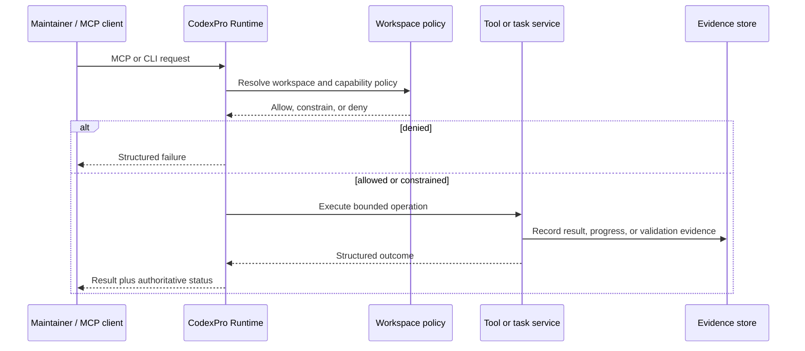

# Architecture

CodexPro Runtime is a local control plane between an MCP client, an explicitly selected source workspace, and optional local execution adapters.

## Design goals

1. Bind every operation to a known workspace identity.
2. Advertise only the tools allowed by the current mode.
3. Treat writes and commands as policy-controlled side effects.
4. Preserve structured task, validation, and recovery evidence.
5. Keep production-specific integrations outside the reusable core.

## Runtime layers

### Transport layer

- MCP stdio server in `src/stdio.ts`
- Streamable HTTP server in `src/http.ts`
- Modern MCP request handling in `src/mcp/modern/`

The transport layer accepts protocol requests but does not independently decide workspace or side-effect authority.

### Configuration and workspace layer

Key responsibilities include:

- resolving explicit roots and allowed roots;
- assigning workspace identity and generation;
- binding connector conversations to a workspace;
- reading project configuration and local rules;
- rejecting path escapes and blocked paths.

Relevant areas include `src/config.ts`, `src/workspaces/`, `src/workspaceOps.ts`, and `src/guard.ts`.

### Tool layer

The tool layer exposes bounded capabilities such as:

- tree, read, and search;
- targeted writes and replacements;
- project detection and rule summaries;
- validation commands;
- task and handoff coordination;
- selected browser runtime primitives.

Tool availability depends on runtime mode and policy. A tool that is not advertised is not part of the active capability surface.

### Execution layer

Execution components track:

- task identity;
- objective and acceptance information;
- execution attempts;
- durable jobs;
- progress and heartbeat state;
- process records;
- validation outcomes;
- review and recovery state.

Relevant areas include `src/tasks/`, `src/jobs/`, `src/execution/`, `src/workflow/`, and `shared/execution-kernel.mjs`.

### Evidence and schema layer

The `schemas/` directory defines machine-readable contracts for authorization, execution, browser evidence, messaging, task outcomes, capabilities, and tool results.

Schemas provide a stable evidence vocabulary. They do not by themselves guarantee that an external model or client behaves correctly.

### Security layer

Security components cover:

- authorization decisions;
- payload integrity;
- redaction;
- sensitive write detection;
- blocked paths;
- HTTP authentication requirements;
- command-mode restrictions;
- allowed-root enforcement.

See [Security model](security-model.md).

## Data flow

## Public/private split

The public repository contains reusable runtime components. Private production integrations, customer data, operational reports, tunnel identity, credentials, and complete private history are excluded.

The private implementation remains authoritative for private operations. Public changes must be exported through a reviewed allowlist.

## Local agent boundary

CodexPro can coordinate local handoff and task execution, but remote MCP access does not automatically become unrestricted local-agent execution. Local adapters, process commands, and review loops remain explicit local choices.

## Non-goals

The architecture does not attempt to provide:

- an operating-system sandbox;
- hosted multi-tenant isolation;
- automatic repository administration;
- model quota or account management;
- a guarantee that an MCP client will call every tool correctly;
- automatic package, release, or deployment publication.
