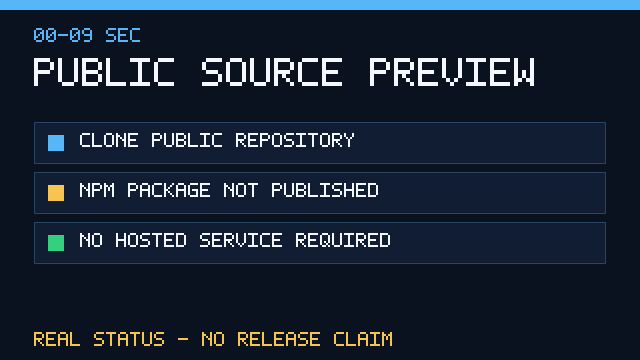
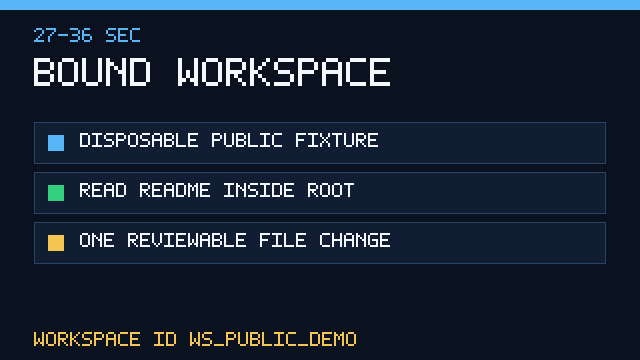
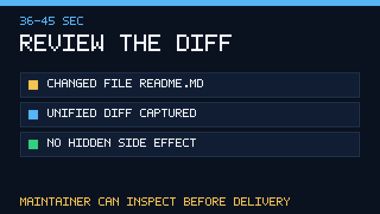
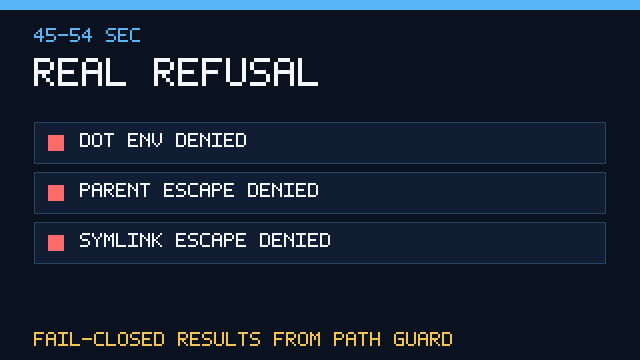
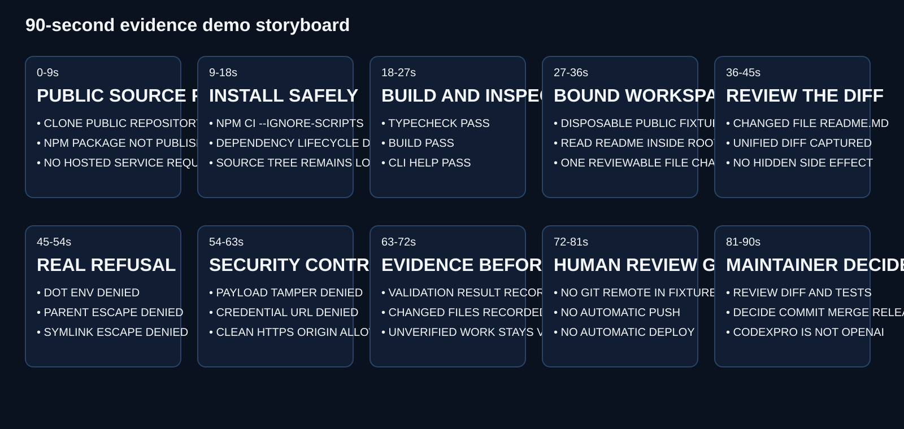
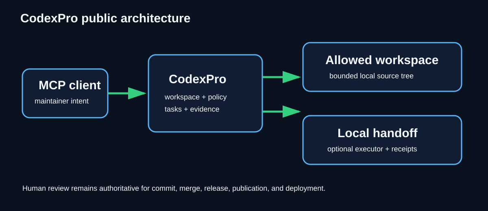
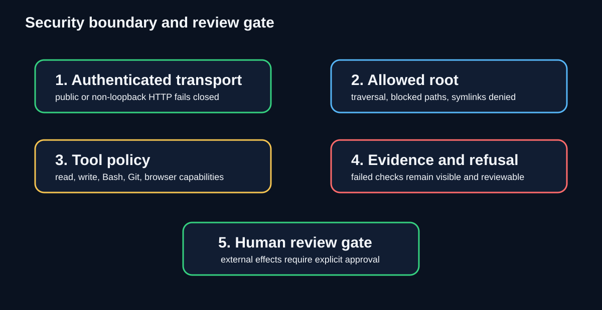

# Evidence Demo

This repository is currently a **public source preview**. The npm package is not published, `package.json` remains private, and there is no hosted CodexPro service, GitHub Release, Pages deployment, or automatic production connection.

The demo assets below are generated from a real disposable local Git workflow. They are not screenshots of ChatGPT, do not imply OpenAI endorsement, and do not contain a private repository path, credential, production address, or external-account session.

## 30-second overview


The GIF compresses six evidence-backed stages: public source status, safe dependency installation, build verification, bounded workspace use, reviewable change evidence, and fail-closed refusal.

## Four evidence frames

| Public source status | Bounded workspace |
|---|---|
|  |  |

| Reviewable change | Real refusal |
|---|---|
|  |  |

## 90-second storyboard



| Time | Evidence shown |
|---|---|
| 0–9 seconds | Clone and inspect the public repository; state that npm and GitHub Release are not published. |
| 9–18 seconds | Install dependencies with lifecycle scripts disabled. |
| 18–27 seconds | Run type checking, build, and CLI help checks. |
| 27–36 seconds | Create a disposable Git fixture and bind an explicit allowed root. |
| 36–45 seconds | Read and change one allowed README, then capture a unified diff. |
| 45–54 seconds | Show `.env`, parent traversal, and symlink escape being denied. |
| 54–63 seconds | Show authorization-payload tamper and credentialed browser URL refusal, plus an allowed clean HTTPS origin. |
| 63–72 seconds | Show machine-readable evidence instead of relying on a model’s completion claim. |
| 72–81 seconds | Verify the fixture has no Git remote, automatic push, deployment, package publication, or Release. |
| 81–90 seconds | Stop at the human review gate for commit, merge, release, publication, and deployment decisions. |

## Reproduce the evidence

Requirements: Node.js 20 or newer, npm, and Git.

```bash
npm ci --ignore-scripts --no-audit --no-fund
npm run build
npm run demo:workflow
npm run demo:generate
npm run demo:check
```

The workflow creates and deletes a temporary repository under the operating system’s temporary directory. It uses the reserved `example.invalid` domain and a synthetic local Git identity. It never adds a remote.

The generated evidence is stored in [demo-evidence.json](../.github/assets/demo-evidence.json). The JSON records the disposable workflow result, one changed file, three refusal results, and the absence of external side effects.

## Architecture and security boundary





## Optional MP4 rendering

The repository includes ten 9-second storyboard frames and a deterministic renderer:

```bash
npm run demo:video
```

This requires a trusted `ffmpeg` executable in `PATH`. The current generation environment did not provide a working encoder, so no MP4 is committed and no invalid video file is presented as evidence. The committed GIF, PNG, SVG, generator, verification script, and machine-readable evidence remain fully reproducible without an encoder.

## Human-control boundary

The demo intentionally stops before external effects. CodexPro can collect evidence and prepare reviewable work, but a human maintainer remains responsible for repository permissions, accepted risk, commit, merge, security disclosure, GitHub Release, npm publication, and production deployment.
