# Security Model

CodexPro Runtime gives an MCP client controlled access to one explicitly selected local source workspace. The client and model may be mistaken or adversarial, while file writes, shell commands, Git operations, browser control, and release actions can affect real developer assets. Security therefore depends on layered controls, observable evidence, and a human maintainer retaining final authority.

## One-page boundary

```mermaid
flowchart LR
    U[Maintainer / MCP client] --> A[Authenticated transport]
    A --> W[Conversation-bound workspace]
    W --> P[Path and capability policy]
    P --> R[Risk + permission decision]
    R --> T[Bounded tool execution]
    T --> E[Structured evidence]
    E --> H[Human review]
    H -->|explicit approval| S[Git / release / other side effect]
```



The controls reduce accidental and model-driven misuse. They do **not** provide an operating-system sandbox, protection from a compromised local account, hosted multi-tenant isolation, or automatic secure deployment.

## Assets to protect

- source code, repository history, and package contents;
- credentials, tokens, cookies, private keys, and tunnel configuration;
- customer or business data;
- local paths, browser sessions, and developer identity;
- command, Git, release, and deployment authority;
- validation and completion evidence.

## Trust assumptions

- The local machine owner and repository host account are trusted.
- The selected workspace root is intentional and repository-specific.
- The MCP client, model, downloaded content, and task instructions may be wrong or malicious.
- Reads are lower risk than writes; local writes are lower risk than external side effects.
- Public or non-loopback HTTP requires authentication.
- Human approval remains authoritative for merge, release, publication, disclosure, and accepted risk.

## Threat, control, test, and residual-risk matrix

| Security surface | Threat | Implemented control | Reproducible check or evidence | Residual risk |
|---|---|---|---|---|
| Public HTTPS / tunnel authentication | An unauthenticated client reaches a local source workspace | HTTP configuration requires a token for public or non-loopback use; the no-token override is documented as loopback-only | Public source: `src/config.ts`, `src/http.ts`, and `scripts/lib/http-smoke-auth.mjs`; build and CLI checks run in CI | A reverse proxy or operator can still be misconfigured; transport authentication is not user-level authorization |
| Workspace path isolation | Traversal, an over-broad root, or a symlink escapes the selected repository | Explicit allowed roots, subpath checks, blocked globs, realpath checks, and write-through-symlink rejection | `npm run security:check` creates a disposable workspace and verifies blocked `.env`, parent escape, and symlink escape failures | A maintainer can deliberately select an unsafe root; path controls are not kernel or container isolation |
| Sensitive writes and redaction | A generated patch or report stores a credential or leaks it through output | Sensitive-write scanning, blocked credential paths, output redaction, and public package exclusions | Public package-boundary check rejects `.env`, credential-like files, private planning state, and runtime evidence; maintainer Full Release Safety scans exact candidate paths | Novel or heavily obfuscated secret formats may evade pattern-based detection; review is still required |
| Shell, Git, and external side effects | A task runs an unsafe command, pushes unintended content, or converts analysis into an external write | Off/safe/full Bash modes, L0-L3 risk decisions, monotonic permission decisions, pre-execution payload binding, exact-path Git finalization, and explicit external-effect authorization | Public source: `src/security/` and `src/adapters/git-adapter.ts`; CI checks buildability; release delivery uses exact SHA verification and Full Release Safety | Full Bash and a compromised local account remain powerful; repository-host permissions and branch protection are external controls |
| Browser / CDP authorization | A remote task controls the wrong tab, persists an unsafe URL, or captures credentials | Challenge-bound tab authorization, instance/tab/window identity, expiry, origin checks, credentialed-URL rejection, redaction, and restricted persistence | `npm run security:check` verifies credentialed browser URLs are rejected and a clean origin can be authorized | A compromised browser profile, extension, or already-authenticated page can expose data; browser authorization is not website authorization |
| Agent handoff and workspace identity | A stale task, another conversation, or an unverified agent result changes the wrong workspace | Conversation-scoped workspace binding, workspace generation, execution-origin receipts, task identity, completion proofs, and evidence-based finalization | Public schemas and `src/runtime/`, `src/tasks/`, `src/agents/`, and `src/guard.ts`; maintainer capability certification and multi-conversation regression evidence | Correct identifiers cannot guarantee correct intent; social engineering and flawed acceptance criteria remain possible |
| Dependency, package, and release supply chain | Private files enter an archive, lifecycle scripts run during initial review, or an unreviewed artifact is published | `npm ci --ignore-scripts` in CI, explicit package allowlist, package dry-run inspection, private package flag, and separate release authorization | `npm run package:check`, CI, and maintainer Full Release Safety; the npm package and GitHub Release are not currently published | Upstream dependency compromise, maintainer account compromise, and future registry configuration remain external risks |

## Public security control smoke

Run after building:

```bash
npm run security:check
```

The smoke uses temporary, disposable paths and placeholder data. It verifies:

1. an allowed workspace file resolves normally;
2. `.env`, parent-directory escape, and symlink escape are denied;
3. invisible Unicode in an authorization payload is detected;
4. an authorization binding fails after payload tampering;
5. a credentialed browser URL is rejected;
6. a normal HTTPS origin can be authorized with a valid challenge.

It does not access a production tunnel, a real credential, a private repository, or an external account.

## Security test families

The maintainer groups deeper regression evidence into six families:

- **Path and secrets:** traversal, blocked paths, symlinks, write scanning, package leakage, and redaction.
- **Shell and Git:** Bash modes, command policy, side-effect classification, confirmation, exact commit, and push verification.
- **HTTP and authentication:** loopback exceptions, non-loopback fail-closed behavior, token handling, and proxy assumptions.
- **Browser:** challenge lifecycle, tab ownership, credentialed URLs, origin binding, persistence, and expiry.
- **Agent and workspace:** conversation binding, workspace generation, stale tasks, completion proof, recovery conflict, and execution origin.
- **Package and release:** dependency installation posture, archive contents, secret scan, release receipt, remote SHA, and CI.

Public CI runs documentation checks, type checking, build, CLI help, the security smoke, and package-boundary verification. Broader maintainer acceptance evidence is kept outside the public package when it contains private operational paths or runtime records.

## Why Codex Security is relevant

CodexPro has a broad, security-sensitive surface: local files, command execution, Git delivery, browser sessions, agent handoff, and network-facing MCP transports. A Codex Security workflow would be used to:

- map a high-risk change across implementation, schemas, documentation, and tests;
- review diffs for path, authorization, redaction, and confused-deputy flaws;
- classify a vulnerability and identify the smallest safe fix;
- generate or update targeted positive and negative regressions;
- verify that public security documentation and release notes match the implemented control;
- preserve a reviewable evidence package for the human maintainer.

Codex or any other AI system may propose code, tests, or findings. It does not approve its own security exception, merge, disclosure, release, npm publication, or deployment.

## Public HTTP checklist

Before any public or tunnel exposure:

1. Store a strong authentication value outside the repository.
2. Confirm requests without authentication fail closed.
3. Bind one repository-specific allowed root.
4. Keep Bash safe or off.
5. Keep generic writes disabled unless required.
6. Avoid logging prompts, query strings, file contents, or full command output.
7. Confirm no connector URL containing authentication data is committed or shared.
8. Review [SECURITY.md](../SECURITY.md) and the current diff.

## Private vulnerability reporting

GitHub Private Vulnerability Reporting is enabled for this repository, verified through GitHub's dedicated repository endpoint on 2026-08-03 UTC. Report suspected vulnerabilities through the [private reporting form](https://github.com/Menglook/codexpro-runtime/security/advisories/new). Never include active credentials, private customer data, or unnecessary exploit material in a public Issue.

See the concise [Codex Security case](codex-security-case.md) for the application-oriented summary.
